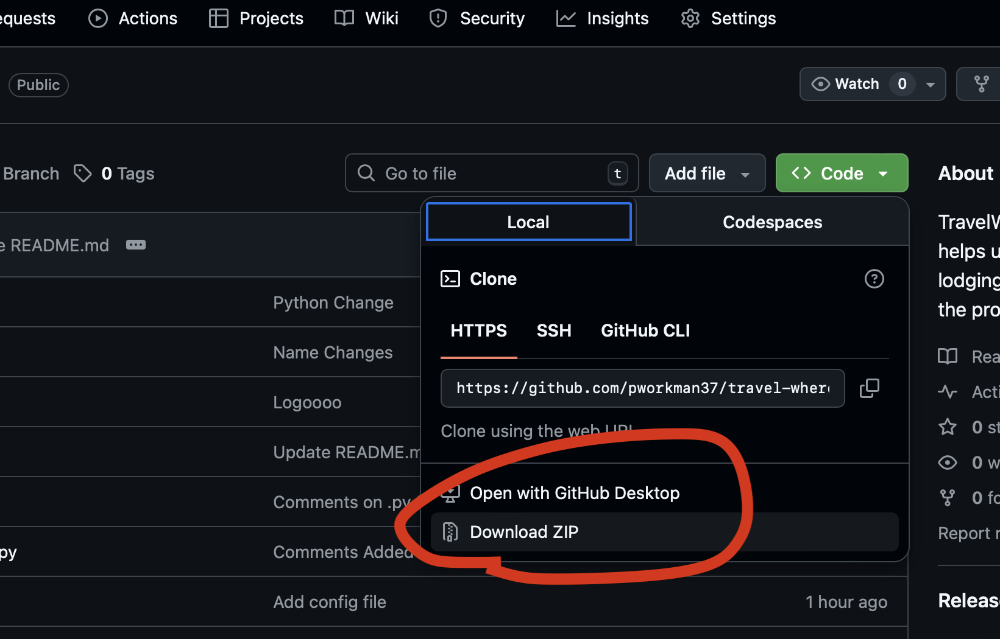
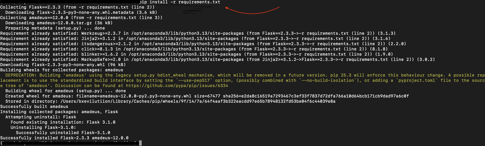
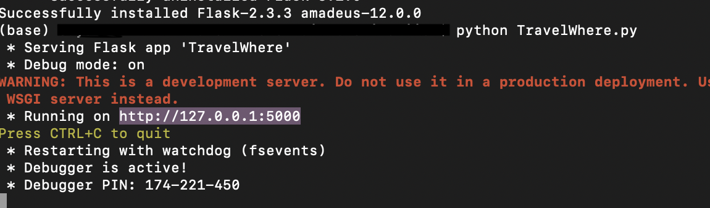
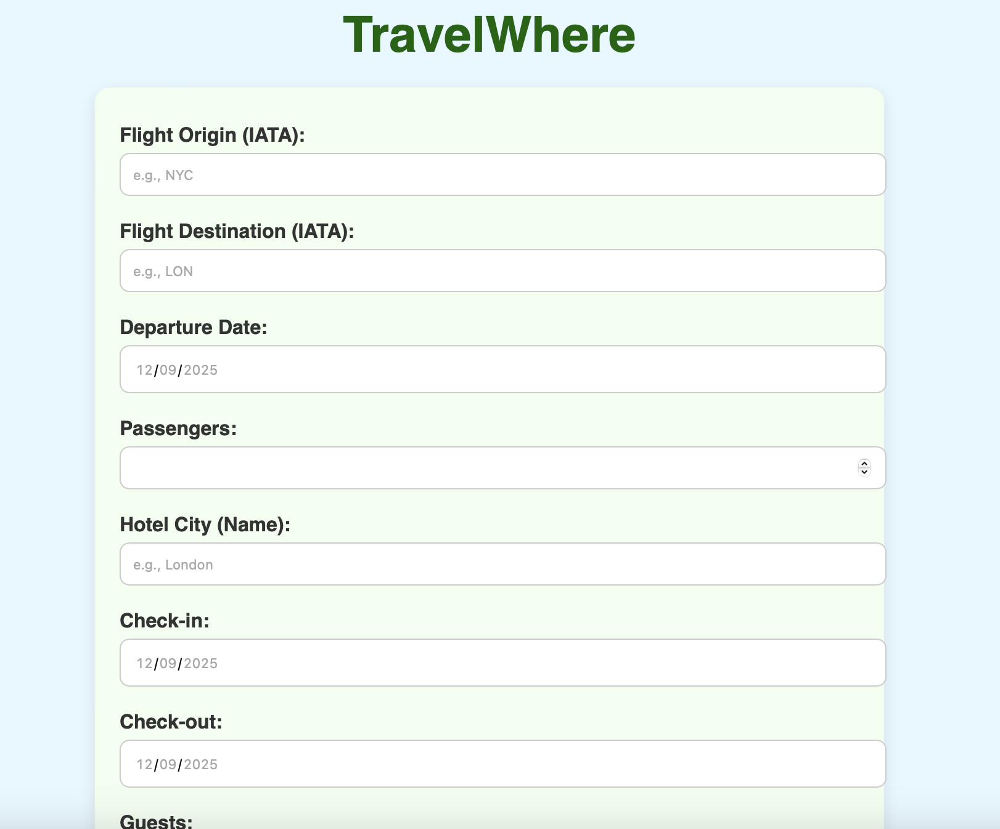
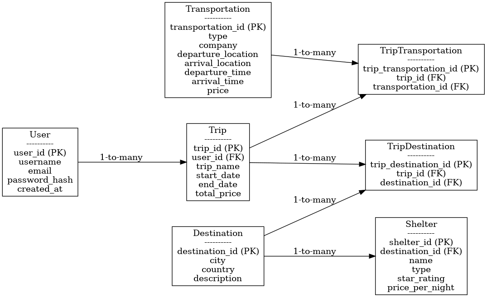

  

---

TravelWhere is a software that offers users flight prices and hotel prices for their vacation. It offers 3 options a luxury, cheap, and average price for all trips.

## Table of Contents
- [Set up](#set-up)
  - [Download](#download)
  - [Website Access](#website-access)
- [User Manual](#user-manual)
- [Database Design](#database-design)

## Set up
Download The Zip File

  

## Download
Download Requirements

  

## Website Access
Paste Website URL in browser

  

## User Manual
Input Constraints:
- Origin Airport Code
- Destination Airport Code
- Flight Date mm/dd/yyyy
- Passengers must be =>1
- Enter shelter city name (Any City)
- Shelter Check in Date mm/dd/yyyy
- Shelter Check out Date mm/dd/yyyy 
- Guest must be =>1

  

## Database Design

ER Diagram

  

