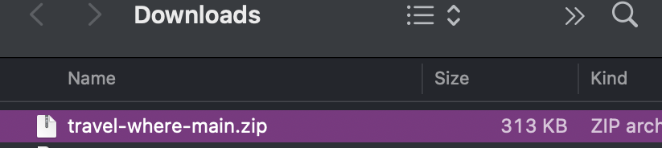
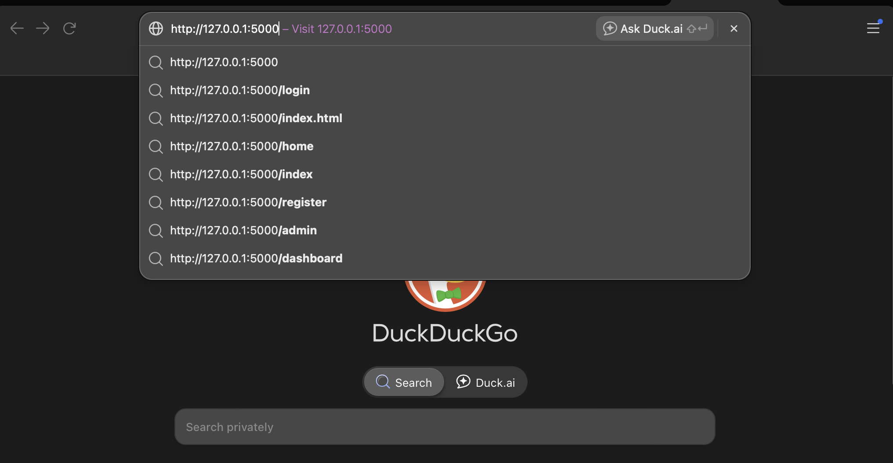

<p align="center">
  
</p>
---

TravelWhere is a software service that offers users both flight and hotel prices for their vacations. It offers 3 options: a luxury, cheap, and average price for all trips.

## Table of Contents
- [Set up](#set-up)
  - [Download](#download)
  - [Website Access](#website-access)
- [User Manual](#user-manual)
- [Database Design](#database-design)
- [Trello Board] (#trello-board)
## Set up
Download The Zip File
<p align="center">
  
</p>

And open the zip file
<p align="center">
  
</p>

## Download
In your Powershell or Terminal, you want to open the contents of the zip folder with the command:
```
cd folder-path/travel-where-main
```

Then, Download Requirements
If, python is not on your device please run pip install .
```
pip install -r requirements.txt
```
<p align="center">
  
</p>

## Website Access
Then, in your PowerShell run the command python TravelWhere.py

Paste Website URL in browser
<p align="center">
  
</p>

<p align="center">
  
</p>

## User Manual
Input Constraints:
- Origin Airport Code
- Destination Airport Code
- Flight Date mm/dd/yyyy
- Passengers must be =>1
- Enter shelter city name (Any City)
- Shelter Check in Date mm/dd/yyyy
- Shelter Check out Date mm/dd/yyyy 
- Guest must be =>1

<p align="center">
  
</p>

## Database Design

ER Diagram
<p align="center">
  

## Trello Board
<p><a href="https://www.example.com">Visit Example.com</a></p>


Thank you !!
</p>

